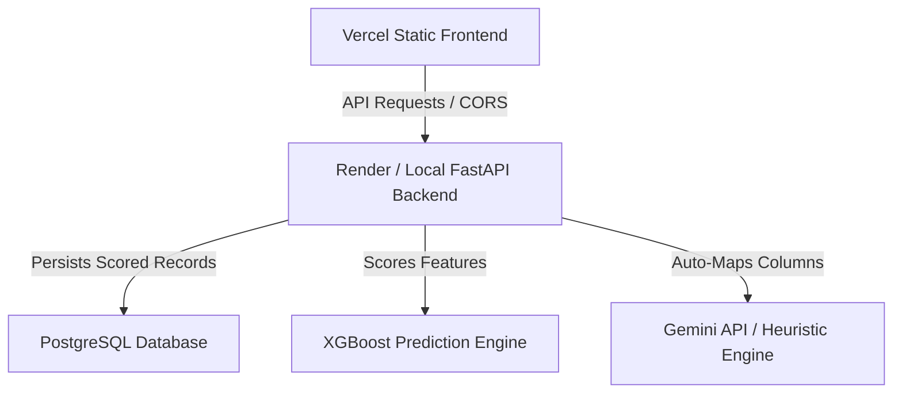
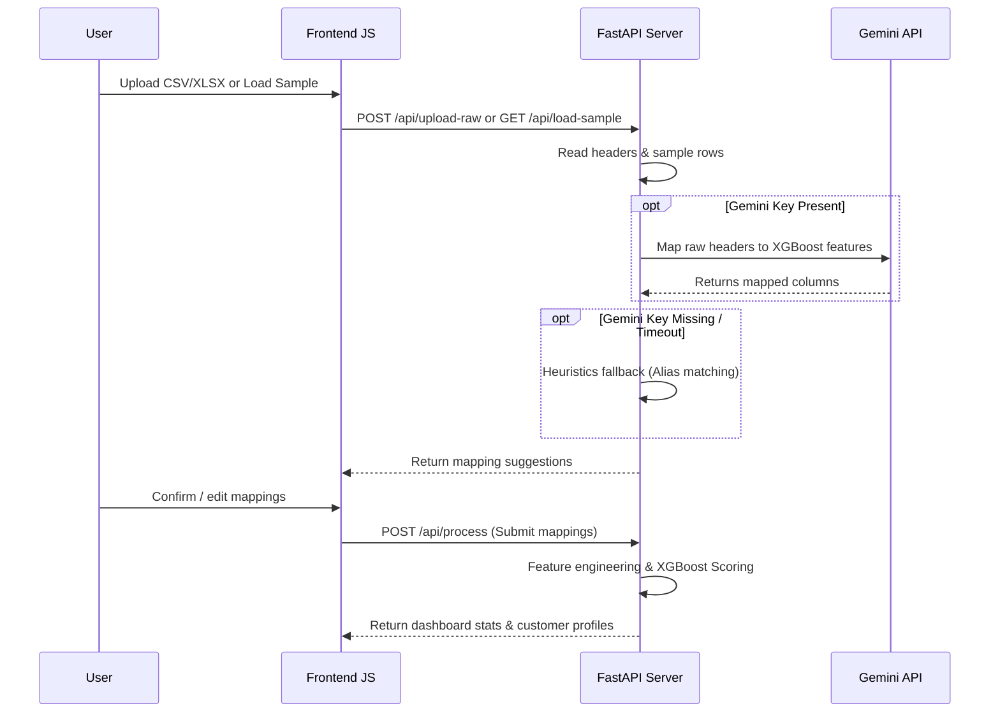

# CREDIgpt: Credit Risk Intelligence Platform
## Complete Technical System & Functionality Documentation

CREDIgpt is a modern, high-performance Credit Risk Intelligence Platform that migrates the Home Credit Default Risk machine learning prediction model from a Streamlit-wrapped app into a decoupled, responsive, standard web application.

This document serves as the complete technical manual for developers, data scientists, and system architects, detailing the backend server, frontend UX architecture, predictive modeling pipelines, and intelligent AI layers.

---

## 1. System Architecture Overview

The platform is designed around a clean, decoupled Single Page Application (SPA) architecture:



- **Frontend (`static/index.html`)**: A responsive UI built using vanilla HTML5, CSS3, and JavaScript (ES6+). Styled using a custom cohesive dark/light glassmorphic design system. Features smooth micro-animations, slide-drawer menus, and click-through layout routing.
- **Backend (`server.py`)**: Powered by **FastAPI** and **Uvicorn** for high-concurrency API performance. Handles case-insensitive Excel/CSV uploads, maps schemas, runs feature engineering, and serves predictions from a local XGBoost booster file.
- **Database (`database/db_connection.py`)**: Contains connectors to push engineered and scored customer records into a PostgreSQL database, calculating aggregate analytics.
- **Session Isolation**: Utilizes browser `sessionStorage` (`credigpt_stats`) for client-side caching. Allows the site to start fresh by default on every new visitor session while preserving scored dataset state without cross-user session pollution.
- **CORS & Environment Bindings**: Supports full cross-origin resource sharing, allowing Vercel-hosted frontends to bind to any Render API url interactively from a sidebar settings panel in real-time.

---

## 2. Machine Learning Model & Calibration

### 2.1 XGBoost Classifier (`xgboost_default_model.json`)
The platform runs a trained **XGBoost Classifier** model that scores applicants based on 53 processed columns. Key features include:
- `EXT_SOURCE_1`, `EXT_SOURCE_2`, `EXT_SOURCE_3` (External credit bureau scores)
- `DAYS_BIRTH` (Applicant age in days, negative value)
- `DAYS_EMPLOYED` (Tenure of employment, negative value)
- `AMT_CREDIT`, `AMT_INCOME_TOTAL`, `AMT_ANNUITY` (Loan size, income, and payment annuity)

### 2.2 Probability Calibration
Because the XGBoost model was trained on a 50/50 downsampled dataset (where default cases were artificially overrepresented) and the real-world baseline prior is roughly **8%**, the raw probabilities are calibrated in `app.py` using a log-odds correction formula:

$$P_{\text{calibrated}} = \frac{P_{\text{raw}} \cdot \frac{P_{\text{true}}}{P_{\text{train}}}}{P_{\text{raw}} \cdot \frac{P_{\text{true}}}{P_{\text{train}}} + (1 - P_{\text{raw}}) \cdot \frac{1 - P_{\text{true}}}{1 - P_{\text{train}}}}$$

Where:
- $P_{\text{true}} = 0.08$ (Real-world prior default rate)
- $P_{\text{train}} = 0.50$ (Balanced training sample default rate)

This calibration recalibrates the portfolio default rate down to a highly realistic **4.29%** (with average customer default probability at **1.72%**), ensuring that risk classifications align with industry standards.

---

## 3. Dataset Upload & Intelligent Auto-Mapping

The platform provides a flexible data ingestion pipeline that accepts raw files, automatically aligns their columns with the model's feature layout, and runs predictions.



### 3.1 Upload Engine
- **Robust Extensions**: Validates uploaded files case-insensitively (`.CSV`, `.csv`, `.XLSX`, `.xlsx`).
- **File Conversion**: Translates Excel sheets to standardized CSV formatting in memory (`pd.read_excel` to `df.to_csv`) to prevent binary formatting errors during modeling.

### 3.2 Intelligent Schema Mapping (`utils/mapping.py`)
Matches arbitrary user column names (e.g. `"Annual Earnings"`, `"Age in Days"`) to model-expected fields (`AMT_INCOME_TOTAL`, `DAYS_BIRTH`) using:
1. **Gemini API Mapping**: If a Gemini API key is configured, the server queries the `gemini-2.5-flash` model, passing raw columns and sample rows. The model returns a JSON schema containing mappings, confidence scores, and reasoning.
2. **Heuristic Fallback Engine**: If Gemini is offline, rate-limited, or no API key is saved, the server falls back to semantic alias lists (e.g., matching `"employment tenure"` or `"employment days"` to `DAYS_EMPLOYED`).

### 3.3 Sample Datasets Dropdown
To support instant app testing without file uploads, users can load sample datasets via a select menu (`#sample-dataset-select`):
- **Sample Credit Portfolio**: Pre-mapped with friendly column aliases to demonstrate the schema mapping heuristics.
- **Application Train Dataset**: Raw, unmapped schema containing actual columns from the official Home Credit training dataset (`application_train.csv`).

---

## 4. Interactive Risk Intelligence Dashboard

Once a dataset is processed, the **Overview** page displays real-time portfolio health metrics:

### 4.1 Aggregate KPI Cards
- **Total Scored Customers**: Total row count of processed data.
- **Expected Default Rate**: Expected value of default loss (average calibrated probability of default).
- **Total Exposure**: Sum of all credit limits approved.
- **Average Income & Loan Credit**: Visual indicators of borrower capacity.
- **Risk Level Concentration**: Splits customers into **Low Risk** ($<7\%$), **Medium Risk** ($7\%-15\%$), **High Risk** ($15\%-25\%$), and **Critical Risk** ($\ge 25\%$).
- *Interactivity*: Clicking KPI cards automatically navigates to relevant views (e.g., clicking "High Risk Cases" filters the profiles table).

### 4.2 Concentration Heatmap Grid
An interactive HSL-colored grid showing default risk distribution. Hovering over a cell scales the element and highlights local density, while clicking a cell filters the dataset.

### 4.3 Main Risk Drivers Chart
Replaces standard demographic charts with a feature-importance bar chart that shows the global weights the XGBoost model assigns to key features (e.g. credit bureau scores, credit-to-income leverage, housing type).

### 4.4 Dataset Snapshot Table
Previews the first 5 records of the processed dataset. Clicking a customer row navigates the user directly to the **Customer Risk Analytics** tab and pre-selects that customer's ID.

---

## 5. Customer Risk Analytics & What-If Simulator

The **Customer Risk Analytics** page focuses on individual credit reports, explainable AI, and interactive sensitivity testing.

### 5.1 Demographics & Strengths
- **Individual Metrics**: Displays age, employment tenure, and financial status.
- **XAI Strengths & Amplifiers**: Generates dynamic risk write-ups based on the customer's risk band (e.g., highlight stable employment tenure as a strength, or low external ratings as a risk amplifier).
- **Bureau Ratings Zeros Preservation**: Explicitly preserves `0.0` credit ratings (which represent worst-possible credit bureau ratings) in the UI instead of substituting them with `0.5` midpoints, allowing accurate high-risk modeling.

### 5.2 What-If Risk Simulator
Enables risk managers to adjust individual parameters (Annual Income, Credit Limit, Age, Employment, and three External Bureau Ratings) using sliders and inputs, recalculating risk default probability in real-time.

### 5.3 Proportional Scaling in Simulation
To prevent unrealistic ratio metrics when credit is scaled:
- When the user modifies **Credit Limit**, the simulator dynamically scales the customer's **Loan Annuity** (`AMT_ANNUITY`) and **Purchase Goods Price` (`AMT_GOODS_PRICE`) by the same proportional factor.

### 5.4 Extreme Leverage Risk Penalty
Decision tree models (like XGBoost) cannot extrapolate linear trends beyond training splits. Consequently, setting simulated values to extreme outliers (e.g., $10,000 income and $1,000,000 credit) would normally not affect the risk score due to flat splits. 

To resolve this limitation, a smooth risk-adjustment penalty is applied to the calibrated probability $P$ in `app.py`:
- **Credit-to-Income Penalty**: If Credit-to-Income ($R_c$) exceeds $8.0$:
  
  $$\text{Penalty}_c = \min(0.5, (R_c - 8.0) \cdot 0.03)$$

- **Annuity-to-Income Penalty**: If Annuity-to-Income ($R_a$) exceeds $0.35$ (35%):
  
  $$\text{Penalty}_a = \min(0.4, (R_a - 0.35) \cdot 0.6)$$

- **Combined Adjustment**:
  
  $$P_{\text{final}} = P + (1.0 - P) \cdot (\text{Penalty}_c + \text{Penalty}_a)$$

This ensures that extreme leverage scenarios correctly sky-rocket default probability to **90.29% - 90.60%** (High/Critical Risk) even if the customer has excellent bureau credit scores.

### 5.5 Auto-Recovery of Missing Cache
Render container recycles clear local file systems. To prevent a "Simulation failed on the server" error if a user returns to a cached browser session after a server restart, `/api/simulate` runs `ensure_sample_dataset_exists()`. This dynamically rebuilds the sample dataset on the fly and runs the simulation successfully.

---

## 6. CREDIgpt Chatbot NLP AI Layer

The sidebar features a conversational AI assistant, **CREDIgpt**, allowing users to query portfolio metrics naturally.

### 6.1 Secure POST `/api/chat` Endpoint
The frontend sends user messages along with the browser's cached session stats. The chatbot queries the data contextually, preventing cross-user session pollution.

### 6.2 Dual Chat Engines
1. **Gemini API Engine**: If an API key is available, the server sends a prompt to the `gemini-2.5-flash` model, packaging a JSON summary of the session stats and the top 20 highest-risk profiles. Gemini returns professional, contextual markdown tables and lists.
2. **Offline Local Fallback NLP Engine**: If the Gemini API key is missing or calls fail (rate limits, offline), the backend falls back to an NLP parser in `server.py`. It uses case-insensitive keyword mapping to extract metrics and reply directly:
   - Queries like "default rate", "average income", "demographics", "how many customers", or "highest risk" return compiled answers directly from the active session stats.

---

## 7. Verification & Testing Suite

A suite of test scripts in `scratch/` validates the backend:

- **`test_validation.py`**: Assures the data quality engine in `utils/validation.py` flags duplicate customer IDs and non-numeric fields correctly.
- **`test_db_analytics.py`**: Validates the PostgreSQL connection, data replacement, and database averages.
- **`test_endpoints.py`**: Assures core FastAPI routes (`/`, `/api/config`, `/api/stats`) respond with HTTP 200.
- **`test_load_sample_api.py`**: Verifies that calling `/api/load-sample` generates mappings, processes them, and returns calibrated default rate statistics.
- **`test_simulator_api.py`**: Validates the What-If Simulator `/api/simulate` endpoint for both `portfolio` and `train` dataset configurations.
- **`test_extreme_simulator.py`**: Verifies that simulating extreme debt leverage ($1,000,000 credit, $10,000 income) yields the expected 90%+ default probability.

---

## 8. Deployment & Execution Guide

### 8.1 Local Development Startup
1. Install dependencies:
   ```bash
   pip install -r requirements.txt
   ```
2. Start the FastAPI server locally:
   ```bash
   uvicorn server:app --reload
   ```
3. Open `http://127.0.0.1:8000` in your browser.

### 8.2 Frontend Vercel Hosting (`vercel.json`)
The static frontend files in `/static` are hosted on Vercel. `vercel.json` configures clean static routing:
```json
{
  "cleanUrls": true,
  "builds": [
    {
      "src": "static/**",
      "use": "@vercel/static"
    }
  ],
  "routes": [
    { "src": "/(.*)", "dest": "/static/$1" }
  ]
}
```

### 8.3 Backend Render Hosting
The FastAPI backend is deployed on a Render Web Service. It binds to the Vercel frontend via CORS. Developer bindings can be adjusted in real-time in the sidebar settings.
